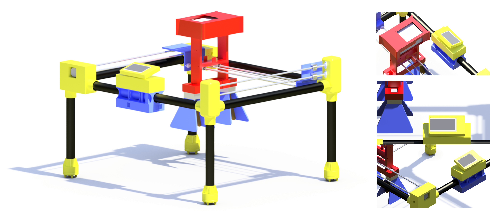
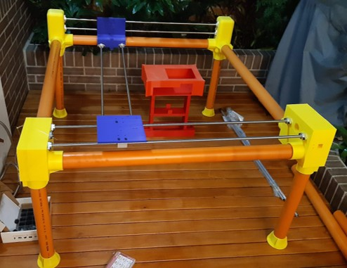

# Contenido multimedia
Recopilación de fotos y videos del proyecto.

## Laboratorio Desminado Humanitario - Universidad de los Andes

## Modelo 3D del GPR Portable

## GPR Portable

## Funcionamiento - GPR de Laboratorio

### Trayectorias GPR:

| Trayectoria "Línea recta"                                    | Trayectoria "Grilla"                                         |
| ------------------------------------------------------------ | ------------------------------------------------------------ |
|  |  |

### Calibración GPR:

### Laboratorio de Desminado

